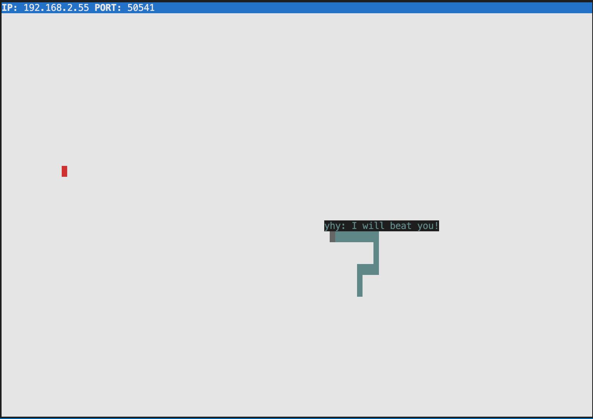

# Snake Client Project

Snake game is a very popular video game. It is a video game concept where the player maneuvers a dot and grows it by ‘eating’ pieces of food. As it moves and eats, it grows and the growing snake becomes an obstacle to smooth maneuvers. The goal is to grow it to become as big as possible without bumping into the side walls, or bumping into itself, upon which it dies.

This is simply a multiplayer take on the genre.

Before you can run this client, you will need to be running the server side which you can download and install from here. 

## Final Product

## Getting Started

- Host setup
  - Go to [snek-multiplayer](https://github.com/lighthouse-labs/snek-multiplayer), clone the repo to local
  - cd into the repository and type `npm install`
  - then type `npm play`
  - keep the terminal `running` while playing
  - take note of the `IP` and `PORT` on the top left
- Player setup
  - Open another terminal windoe
  - Go to [snake-client](https://github.com/yuhaoyann/snake-client), clone the repo to local
  - Open `constants.js` and change the `IP` and `PORT` to what you noted above
  - cd into the repository and type `npm play [your name]` to play, swith `[your name]` with your initials
- Operations
  - Movement: `w, s, a, d`
  - Special message: `u, i, o, p`
